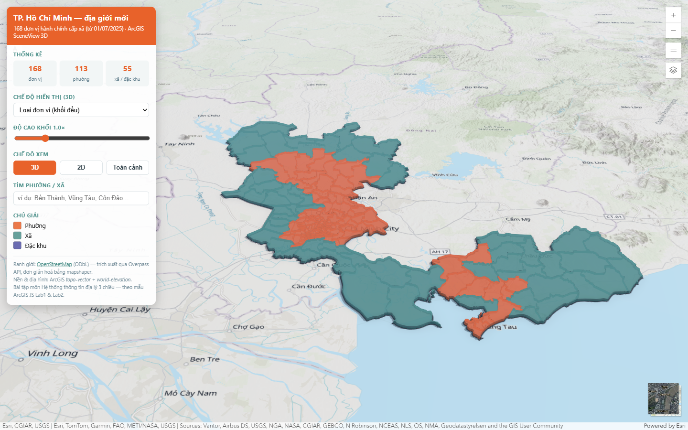
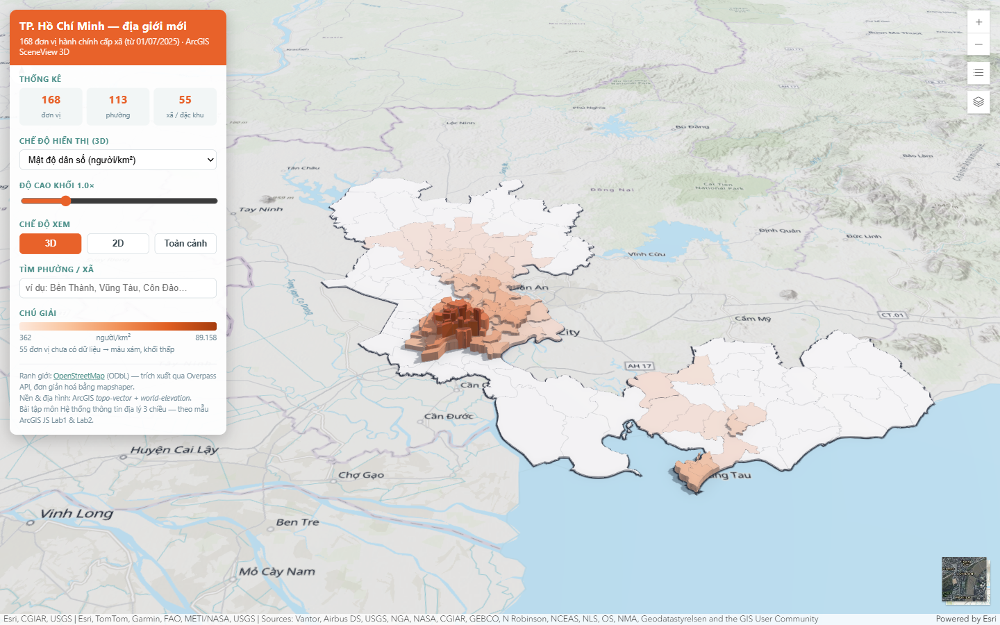

# Bản đồ địa giới hành chính mới TP. Hồ Chí Minh (3D)

Bài tập môn **Hệ thống thông tin địa lý 3 chiều** — vẽ lại bản đồ địa giới TP.HCM
sau sáp nhập (hiệu lực **01/07/2025**: TP.HCM cũ + Bình Dương + Bà Rịa – Vũng Tàu),
dựng bằng **ArcGIS Maps SDK for JavaScript 4.29** theo đúng khuôn mẫu của
`ArcGIS JS - Lab1` và `ArcGIS JS - Lab2` (repo mẫu: `vu-pt/arcgis-sample`).

Kết quả: **168 đơn vị hành chính cấp xã** = 113 phường + 54 xã + 1 đặc khu (Côn Đảo),
tổng diện tích tính được ≈ **6 745 km²** (số liệu công bố: 6 772,6 km² — chênh lệch do
đơn giản hoá hình học).




---

## 1. Chạy thử

GeoJSONLayer đọc file qua HTTP nên **không mở trực tiếp bằng `file://`**:

```bash
cd hcmc-3d-map
npx http-server -p 8099 -c-1
# rồi mở http://127.0.0.1:8099/index.html
```

Cách khác: `python -m http.server 8099`

## 2. Cấu trúc

```
hcmc-3d-map/
├── index.html                  # toàn bộ ứng dụng (1 file, y như style của lab)
├── data/
│   ├── hcmc-wards.geojson      # 168 đơn vị cấp xã, đã đơn giản hoá (~470 KB)
│   ├── hcmc-outline.geojson    # đường biên ngoài của toàn thành phố
│   └── raw-wards.json          # dữ liệu Overpass gốc (8,5 MB) — để tái tạo
└── tools/
    ├── q-wards.overpassql      # truy vấn Overpass
    ├── convert.mjs             # OSM JSON -> GeoJSON + chuẩn hoá thuộc tính
    └── enrich.mjs              # tính area_km2 (công thức cầu) + density
```

## 3. Nguồn dữ liệu & quy trình tái tạo

Ranh giới lấy từ **OpenStreetMap** (relation `1973756` = Thành phố Hồ Chí Minh),
license ODbL — OSM đã cập nhật đủ 168 đơn vị mới.

```bash
# 1) tải ranh giới cấp xã (admin_level=6) nằm trong relation TP.HCM
curl -X POST --data-binary @tools/q-wards.overpassql \
  https://overpass.private.coffee/api/interpreter -o data/raw-wards.json

# 2) OSM JSON -> GeoJSON, gắn name / unit_type / population
node tools/convert.mjs          # -> data/hcmc-wards.full.geojson (3,5 MB)

# 3) đơn giản hoá (giữ topology) + tách đường biên ngoài
npx mapshaper data/hcmc-wards.full.geojson \
  -simplify visvalingam 12% keep-shapes -clean \
  -o precision=0.000001 data/hcmc-wards.geojson
npx mapshaper data/hcmc-wards.geojson -dissolve -o data/hcmc-outline.geojson

# 4) tính diện tích + mật độ dân số
node tools/enrich.mjs
```

Thuộc tính mỗi đơn vị: `id`, `name`, `short_name`, `unit_type`
(`Phường` / `Xã` / `Đặc khu`), `population`, `area_km2`, `density`, `osm_id`.

> Lưu ý về dữ liệu: OSM chỉ có `population` cho 113/168 đơn vị. Những đơn vị thiếu
> dữ liệu được vẽ **màu xám, khối thấp** và ghi rõ số lượng trong phần chú giải —
> không bịa số.

## 4. Kỹ thuật dùng lại từ Lab1 / Lab2

| Lab | Nội dung trong bài lab | Áp dụng trong `index.html` |
|---|---|---|
| Lab1 | `Map` + `basemap` + `MapView`, `center`/`zoom` | `MapView` cho nút **2D** |
| Lab1 | Bảng `basemap` (`topo-vector`, `hybrid`…) | `topo-vector` + `BasemapToggle` sang `hybrid` |
| Lab1 | Toạ độ longitude/latitude, popup | `popupTemplate` hiển thị diện tích / dân số / mật độ |
| Lab2 | `MapView` → **`SceneView`** | view chính là `SceneView` |
| Lab2 | `ground: "world-elevation"` | có, nên nhìn rõ địa hình Bà Rịa – Vũng Tàu |
| Lab2 | `camera: { position, heading, tilt }` | camera khởi tạo + `goTo` khi bấm **Toàn cảnh** |
| Lab2 | `GeoJSONLayer` + renderer `polygon-3d` / `extrude` | lớp 168 đơn vị, `ExtrudeSymbol3DLayer` |
| Lab2 | Polygon 3D + `SolidEdges3D` | `edges: { type: "solid" }` cho từng khối |

Phần mở rộng thêm so với lab:

- `UniqueValueRenderer` theo `unit_type` (phường / xã / đặc khu).
- `visualVariables` kiểu **size** + **color** → bản đồ khối 3D (prism map) theo
  diện tích, dân số hoặc mật độ dân số, chặng chia theo **phân vị** (2/30/60/85/99 %).
- Thanh trượt phóng đại chiều cao khối 0,2× – 4×.
- Nhãn `label-3d` (có halo) cho tên phường/xã khi zoom gần.
- Chuyển qua lại 3D ⇄ 2D và **giữ nguyên khung nhìn** bằng cách truyền `extent`
  giữa hai view (không dùng `viewpoint`, vì camera nghiêng của SceneView sẽ làm lệch).
- Tìm kiếm theo tên + bay tới đơn vị và mở popup.
- `Legend`, `LayerList`, `BasemapToggle` trong `view.ui`.

## 5. Vài chi tiết đáng lưu ý khi làm bài

- **`objectIdField` + `fields` là bắt buộc** khi `GeoJSONLayer` đọc file tĩnh; nếu
  feature không có thuộc tính nào (như file `-dissolve` xuất ra từ mapshaper, vốn là
  `GeometryCollection`) thì layer sẽ **load lỗi** — phải bọc lại thành
  `FeatureCollection` và gắn ít nhất một field id.
- Khối extrude cao tới ~9 km, nên khi `goTo` vào một đơn vị phải **nới extent** theo
  chiều cao khối (`expand(maxH * 1.8 / widthM)`, kẹp trong 2,5–12) — không nới thì
  camera nằm *bên trong* khối, nới cố định quá nhiều thì đơn vị nhỏ như Côn Đảo bị
  đẩy ra tận ngoài không gian.
- **MapView không vẽ được `polygon-3d` / `extrude`**, và nếu để `labelingInfo` dùng
  `label-3d` trong MapView thì layerView 2D **treo mãi ở trạng thái `updating`** (không
  báo lỗi gì). Vì vậy code có hai bộ renderer + hai label class, đổi qua `applyRenderer()`.
- Ở các chế độ số, renderer là **`simple` + `visualVariables`** (không phải
  `unique-value`), để 55 đơn vị thiếu `population` giữ nguyên màu xám thay vì lấy màu
  của loại đơn vị.
- **Đặc khu Côn Đảo** cách đất liền ~230 km, làm extent toàn tỉnh bị "giãn" rất xa.
  Vì vậy view mặc định đóng khung phần đất liền (`MAINLAND`), muốn xem Côn Đảo thì
  tìm trong ô tìm kiếm.

## 6. Ảnh chụp

| | |
|---|---|
| `docs/01-loai-don-vi-3d.png` | 3D — tô màu theo loại đơn vị (phường / xã / đặc khu) |
| `docs/02-mat-do-dan-so-3d.png` | 3D — khối cao theo mật độ dân số |
| `docs/03-mat-do-dan-so-2d.png` | 2D — cùng dữ liệu, renderer `simple-fill` |
| `docs/04-popup-ben-thanh.png` | popup thuộc tính khi tìm "Bến Thành" |

## 7. Nguồn

- Ranh giới: OpenStreetMap contributors (ODbL), relation 1973756, trích qua Overpass API.
- Nền bản đồ & địa hình: Esri ArcGIS (`topo-vector`, `world-elevation`).
- Khuôn mẫu code: `ArcGIS JS - Lab1/Lab2`, ThS. Phan Thanh Vũ — https://github.com/vu-pt/arcgis-sample
