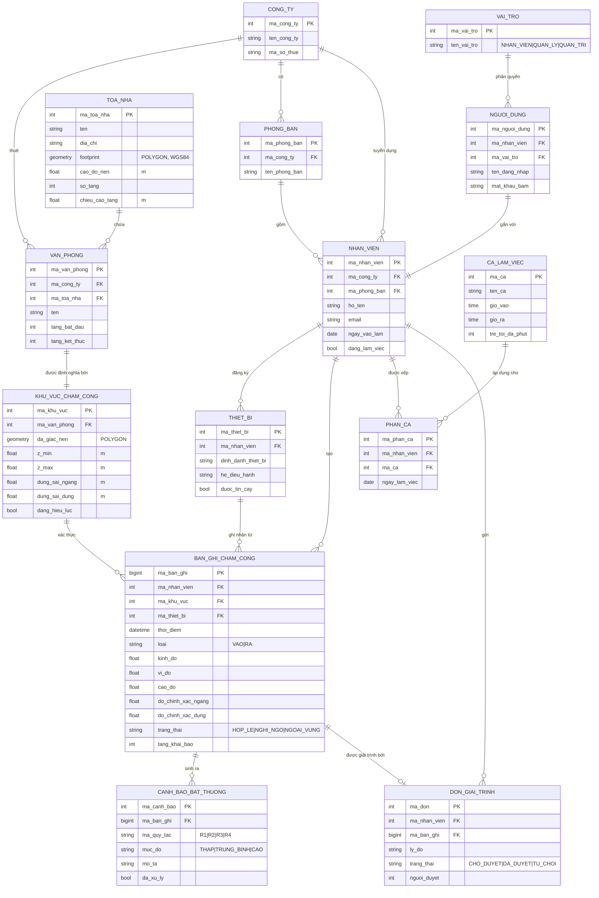
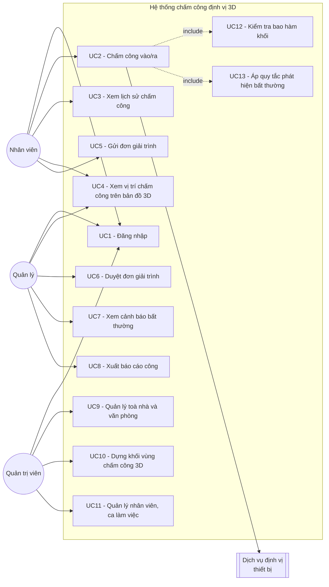
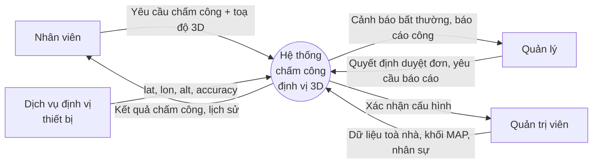
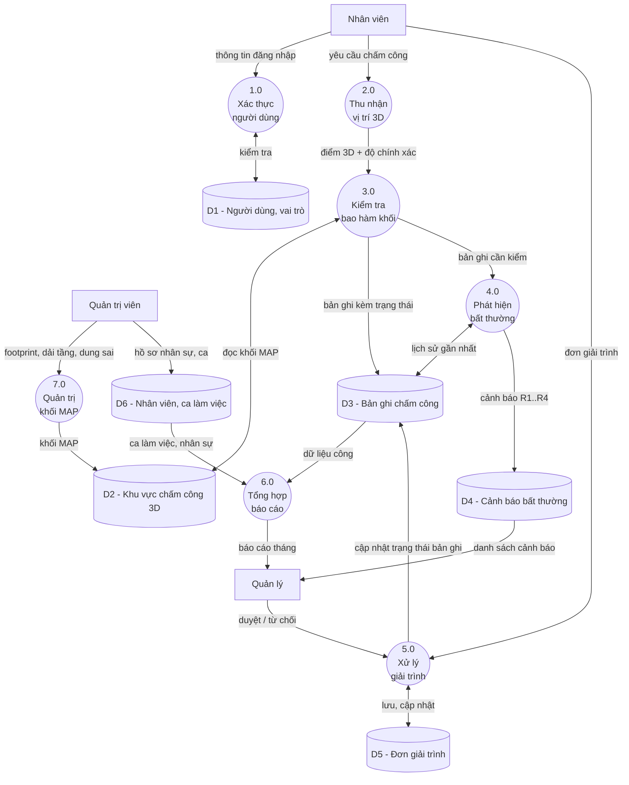
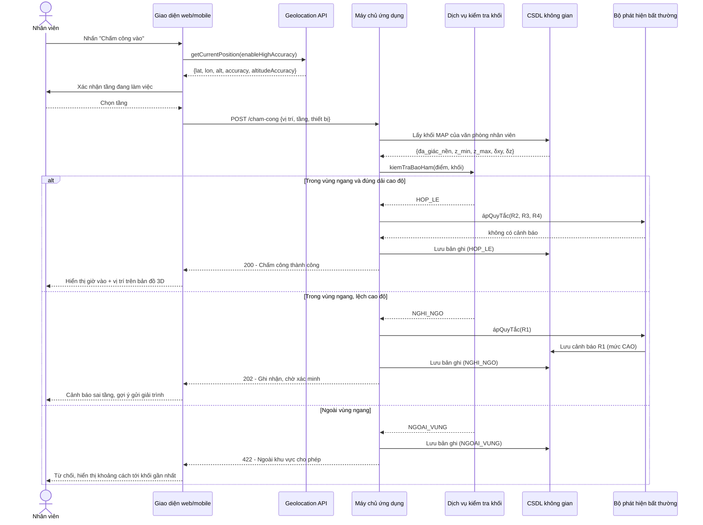
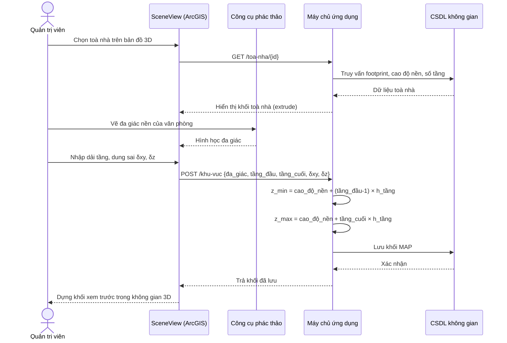
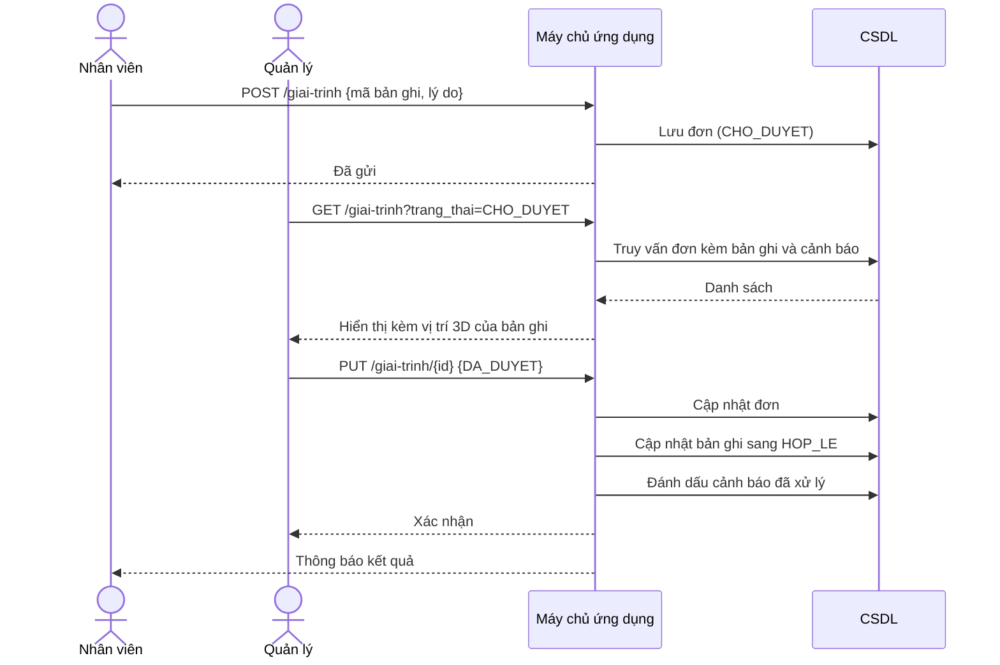

# Hệ thống chấm công định vị 3D theo khối không gian phân tầng

**Đồ án môn học IE402 — Hệ thống thông tin địa lý 3 chiều**

> Tên đề tài đề xuất (dùng cho bìa):
> **“Xây dựng hệ thống chấm công định vị dựa trên mô hình khối không gian 3 chiều
> phân tầng cho toà nhà văn phòng”**

---

# Chương 1: TỔNG QUAN, ĐẶT VẤN ĐỀ, Ý NGHĨA VÀ MỤC TIÊU

## 1.1. Tổng quan

Chấm công định vị (geolocation-based attendance) là hình thức xác nhận sự có mặt của
người lao động bằng toạ độ thiết bị di động thay cho máy chấm công vân tay/thẻ từ. Mô
hình này bùng nổ sau giai đoạn làm việc linh hoạt: doanh nghiệp có nhiều chi nhánh,
nhân viên đi công trường, nhân viên kinh doanh di chuyển liên tục — việc bắt tất cả về
một máy chấm công vật lý là không khả thi.

Hầu hết ứng dụng chấm công định vị hiện nay (bao gồm các sản phẩm thương mại phổ biến
tại Việt Nam) đều dùng **hàng rào địa lý hai chiều (2D geofence)**: một hình tròn bán
kính R quanh một toạ độ, hoặc một đa giác phẳng. Hệ thống chỉ trả lời được câu hỏi
*“người này có đứng trong vùng không?”* trên mặt phẳng.

## 1.2. Đặt vấn đề

Hàng rào 2D thất bại trong chính bối cảnh mà chấm công định vị được dùng nhiều nhất —
**toà nhà văn phòng cao tầng ở đô thị**:

**(a) Không phân biệt được theo chiều cao.** Một cao ốc 30 tầng có hàng chục doanh
nghiệp thuê các tầng khác nhau. Nhân viên công ty A (tầng 5) và nhân viên công ty B
(tầng 22) có **cùng một toạ độ `lat/lon`**. Hàng rào 2D chấp nhận cả hai như nhau. Tệ
hơn: một người ngồi ở quán cà phê tầng trệt, hoặc ở hầm giữ xe, vẫn “chấm công hợp lệ”
cho văn phòng tầng 22.

**(b) Sai số GPS trong đô thị (urban canyon).** Tín hiệu vệ tinh bị các khối nhà cao
tầng chắn và phản xạ nhiều đường (multipath), sai số ngang có thể lên tới hàng chục
mét — đủ để một người ở toà nhà kế bên vẫn lọt vào hàng rào. Trên mặt phẳng 2D không
có cách nào giải thích hay khoanh vùng hiện tượng này; phải có mô hình khối của các
công trình xung quanh mới phân tích được vùng bị che khuất.

**(c) Không phát hiện được gian lận theo chiều đứng.** Các thủ thuật phổ biến — dùng
ứng dụng giả lập vị trí (fake GPS), nhờ đồng nghiệp chấm hộ ngay dưới sảnh — đều tạo
ra bản ghi “đúng toạ độ” nhưng **sai độ cao** hoặc sai quy luật di chuyển. Dữ liệu
2D không giữ được thông tin để phát hiện.

**(d) Không trực quan hoá được để kiểm tra.** Khi có tranh chấp công, người quản lý
cần *nhìn thấy* nhân viên đã chấm công ở đâu. Chấm điểm trên bản đồ phẳng không nói
được điểm đó nằm trong hay ngoài khối văn phòng.

## 1.3. Ý nghĩa và mục tiêu của đề tài

**Ý nghĩa.** Đề tài chuyển bài toán chấm công từ *“điểm thuộc đa giác”* (2D) sang
*“điểm thuộc khối”* (3D), qua đó xử lý được lớp bài toán mà hệ thống 2D không giải
quyết được: phân biệt doanh nghiệp theo tầng trong cùng một cao ốc, và kiểm chứng tính
hợp lệ của bản ghi chấm công theo chiều đứng.

**Mục tiêu cụ thể.**

| # | Mục tiêu | Tiêu chí hoàn thành |
|---|---|---|
| M1 | Xây dựng mô hình dữ liệu 3D cho vùng chấm công phân tầng | Mô hình MAP (mục 2.2) được định nghĩa hình thức và cài đặt trong CSDL không gian |
| M2 | Cài đặt thuật toán kiểm tra “điểm thuộc khối” có xét sai số | Hàm kiểm tra trả về `hợp lệ / ngoài vùng / nghi ngờ`, thời gian < 200 ms |
| M3 | Ứng dụng web cho 3 vai trò: nhân viên, quản lý, quản trị | Đủ luồng chấm công – duyệt – báo cáo |
| M4 | Trực quan hoá 3D bản ghi chấm công trên nền toà nhà dựng khối | SceneView hiển thị khối văn phòng + điểm chấm công theo cao độ |
| M5 | Phát hiện 4 dạng bất thường (mục 2.2.3) | Sinh cảnh báo kèm mức độ |
| M6 | Cho phép quản trị viên **vẽ khối vùng chấm công ngay trên bản đồ 3D** | Công cụ dựng prism + nhập `z_min`, `z_max` |

---

# Chương 2: PHÂN TÍCH VÀ MÔ HÌNH HOÁ

## 2.1. Cơ sở lý thuyết — lựa chọn mô hình 3D

Các mô hình biểu diễn đối tượng 3D thường dùng trong GIS:

| Mô hình | Mô tả | Ưu điểm | Nhược điểm |
|---|---|---|---|
| **2.5D / Prism (khối đùn)** | Đa giác nền + chiều cao đùn lên | Nhẹ, dựng trực tiếp từ footprint + số tầng; phép kiểm tra bao hàm rất rẻ | Không mô tả được phần nhô ra, mái vòm, nội thất |
| **B-Rep** (Boundary Representation) | Mô tả bằng mặt – cạnh – đỉnh | Chính xác, mô tả được hình học phức tạp | Nặng, khó dựng, khó truy vấn không gian |
| **CSG** (Constructive Solid Geometry) | Tổ hợp Boolean các khối cơ bản | Gọn cho hình dạng quy tắc | Không phù hợp dữ liệu đo đạc thực tế |
| **Voxel / Octree** | Chia không gian thành ô lập phương | Truy vấn thể tích, mô phỏng lan truyền tốt | Tốn bộ nhớ, mất độ chính xác biên |
| **TIN** | Lưới tam giác bất quy tắc | Tốt cho địa hình | Chỉ là bề mặt, không phải khối |

**Lựa chọn: mô hình 2.5D Prism.** Lý do:

1. Bài toán chỉ cần trả lời **“điểm có nằm trong khối văn phòng không”**, không cần mô
   tả kiến trúc. Prism là mức chi tiết vừa đủ (tương đương **LoD1** trong chuẩn
   CityGML).
2. Phép kiểm tra tách được thành hai bước rẻ: *point-in-polygon* trên mặt phẳng
   (thuật toán ray casting, O(n) theo số đỉnh) **và** so sánh `z_min ≤ z ≤ z_max`.
   Đáp ứng M2.
3. Dữ liệu đầu vào sẵn có: footprint toà nhà lấy được từ OpenStreetMap, số tầng và
   chiều cao tầng lấy từ khảo sát thực tế — không cần quét laser hay mô hình BIM.
4. Được ArcGIS Maps SDK hỗ trợ trực tiếp bằng `PolygonSymbol3D` +
   `ExtrudeSymbol3DLayer`, và PostGIS hỗ trợ kiểu `POLYGONZ` / `POLYHEDRALSURFACE`.

**Nhược điểm chấp nhận được:** mọi tầng của một văn phòng bị coi là một khối liền,
không mô tả được vách ngăn bên trong. Với bài toán chấm công (chỉ cần xác định *thuộc
văn phòng nào*), đây không phải hạn chế thực chất.

## 2.2. Mô hình hoá — Mô hình MAP (Multi-floor Attendance Prism)

### 2.2.1. Định nghĩa

Biến đổi mô hình prism thuần tuý thành mô hình phục vụ riêng bài toán chấm công, đặt
tên là **MAP — Khối chấm công phân tầng**.

Một khối MAP là bộ:

```
MAP = ( P, z_min, z_max, δxy, δz )
```

| Thành phần | Ý nghĩa |
|---|---|
| `P` | Đa giác nền (footprint) của phần sàn mà văn phòng thuê, hệ WGS84 |
| `z_min` | Cao độ tuyệt đối của sàn tầng thấp nhất mà văn phòng chiếm |
| `z_max` | Cao độ tuyệt đối của trần tầng cao nhất |
| `δxy` | Biên dung sai ngang, bù cho sai số GPS đô thị |
| `δz` | Biên dung sai đứng, bù cho sai số độ cao |

Cao độ được tính từ cao độ nền của toà nhà:

```
z_min = z_nền + (tầng_bắt_đầu − 1) × h_tầng
z_max = z_nền +  tầng_kết_thúc      × h_tầng
```

Khối kiểm tra thực tế là khối MAP đã **nới biên**:

```
MAP⁺ = ( buffer(P, δxy),  z_min − δz,  z_max + δz )
```

### 2.2.2. Phép kiểm tra bao hàm

Với bản ghi chấm công tại điểm `Q = (lon, lat, alt)`:

```
trong_khối(Q, MAP⁺) ⇔ pointInPolygon(Q.xy, buffer(P, δxy))
                    ∧ (z_min − δz) ≤ Q.alt ≤ (z_max + δz)
```

Kết quả phân thành ba trạng thái, thay vì nhị phân đúng/sai:

| Trạng thái | Điều kiện |
|---|---|
| `HOP_LE` | Thoả cả hai điều kiện, và độ chính xác thiết bị báo về ≤ ngưỡng |
| `NGHI_NGO` | Thoả điều kiện ngang nhưng **sai điều kiện đứng**, hoặc độ chính xác kém |
| `NGOAI_VUNG` | Không thoả điều kiện ngang |

Trạng thái `NGHI_NGO` chính là giá trị mà mô hình 2D không thể sinh ra — nó tương ứng
với “đúng toà nhà, sai tầng”.

### 2.2.3. Bốn quy tắc phát hiện bất thường

| Mã | Quy tắc | Cơ sở |
|---|---|---|
| `R1` | Sai tầng | Thoả ngang, lệch đứng vượt `δz` |
| `R2` | Dịch chuyển bất khả thi | Vận tốc suy ra giữa hai bản ghi liên tiếp vượt ngưỡng (ví dụ > 150 km/h) |
| `R3` | Độ chính xác bất thường | `accuracy` báo về quá nhỏ so với thực tế đô thị (dấu hiệu giả lập GPS) hoặc quá lớn |
| `R4` | Trùng thiết bị | Nhiều nhân viên chấm công từ cùng một định danh thiết bị trong khoảng thời gian ngắn |

### 2.2.4. Các đối tượng trong mô hình

| Đối tượng | Vai trò trong mô hình không gian |
|---|---|
| `ToaNha` | Khối bao ngoài, có footprint và cao độ nền — nền cảnh 3D |
| `VanPhong` | Đơn vị thuê, chiếm dải tầng `[tầng_bắt_đầu, tầng_kết_thúc]` |
| `KhuVucChamCong` | Hiện thực của khối MAP (`P`, `z_min`, `z_max`, `δxy`, `δz`) |
| `BanGhiChamCong` | Điểm 3D `(lon, lat, alt)` kèm độ chính xác và thời gian |
| `CanhBaoBatThuong` | Kết quả áp bốn quy tắc R1–R4 lên bản ghi |

## 2.3. Sơ đồ quan hệ của các đối tượng (ERD)



## 2.4. Chuyển ERD thành mô hình quan hệ

```
CONG_TY(ma_cong_ty, ten_cong_ty, ma_so_thue)

PHONG_BAN(ma_phong_ban, ma_cong_ty↑, ten_phong_ban)

TOA_NHA(ma_toa_nha, ten, dia_chi, footprint, cao_do_nen, so_tang, chieu_cao_tang)

VAN_PHONG(ma_van_phong, ma_cong_ty↑, ma_toa_nha↑, ten, tang_bat_dau, tang_ket_thuc)

KHU_VUC_CHAM_CONG(ma_khu_vuc, ma_van_phong↑, da_giac_nen, z_min, z_max,
                  dung_sai_ngang, dung_sai_dung, dang_hieu_luc)

NHAN_VIEN(ma_nhan_vien, ma_cong_ty↑, ma_phong_ban↑, ho_ten, email,
          ngay_vao_lam, dang_lam_viec)

THIET_BI(ma_thiet_bi, ma_nhan_vien↑, dinh_danh_thiet_bi, he_dieu_hanh, duoc_tin_cay)

CA_LAM_VIEC(ma_ca, ten_ca, gio_vao, gio_ra, tre_toi_da_phut)

PHAN_CA(ma_phan_ca, ma_nhan_vien↑, ma_ca↑, ngay_lam_viec)

BAN_GHI_CHAM_CONG(ma_ban_ghi, ma_nhan_vien↑, ma_khu_vuc↑, ma_thiet_bi↑,
                  thoi_diem, loai, kinh_do, vi_do, cao_do,
                  do_chinh_xac_ngang, do_chinh_xac_dung, trang_thai, tang_khai_bao)

CANH_BAO_BAT_THUONG(ma_canh_bao, ma_ban_ghi↑, ma_quy_tac, muc_do, mo_ta, da_xu_ly)

DON_GIAI_TRINH(ma_don, ma_nhan_vien↑, ma_ban_ghi↑, ly_do, trang_thai, nguoi_duyet↑)

VAI_TRO(ma_vai_tro, ten_vai_tro)

NGUOI_DUNG(ma_nguoi_dung, ma_nhan_vien↑, ma_vai_tro↑, ten_dang_nhap, mat_khau_bam)
```
*(gạch chân = khoá chính; ↑ = khoá ngoại)*

**Ràng buộc toàn vẹn cần nêu trong báo cáo:**

- `VAN_PHONG.tang_bat_dau ≤ VAN_PHONG.tang_ket_thuc ≤ TOA_NHA.so_tang`
- `KHU_VUC_CHAM_CONG.z_min < z_max`; hai giá trị này **được suy ra** từ `TOA_NHA` và
  `VAN_PHONG` (thuộc tính dẫn xuất — cần nói rõ là lưu trữ phi chuẩn hoá có chủ đích
  để tránh tính lại khi truy vấn nóng).
- Mỗi `NHAN_VIEN` chỉ có tối đa một bản ghi `VAO` chưa có `RA` tương ứng trong ngày.
- `PHAN_CA(ma_nhan_vien, ngay_lam_viec)` là khoá dự tuyển (một người một ca mỗi ngày).

## 2.5. Sơ đồ trường hợp sử dụng (Use Case)



### Đặc tả một số use case chính

**UC2 — Chấm công vào/ra**

| Mục | Nội dung |
|---|---|
| Tác nhân | Nhân viên |
| Tiền điều kiện | Đã đăng nhập; thiết bị đã cấp quyền định vị; có ca làm việc trong ngày |
| Luồng chính | 1. Nhân viên mở màn hình chấm công.<br/>2. Hệ thống yêu cầu vị trí từ thiết bị.<br/>3. Thiết bị trả `(kinh_độ, vĩ_độ, cao_độ, độ_chính_xác)`.<br/>4. Nhân viên xác nhận tầng đang làm việc.<br/>5. Hệ thống thực hiện UC12 (kiểm tra bao hàm khối).<br/>6. Hệ thống thực hiện UC13 (áp R1–R4).<br/>7. Hệ thống lưu bản ghi kèm trạng thái và hiển thị kết quả. |
| Luồng thay thế 3a | Thiết bị không trả được cao độ → dùng tầng khai báo ở bước 4, đánh dấu `nguon_cao_do = KHAI_BAO`. |
| Luồng ngoại lệ 5a | Ngoài vùng ngang → từ chối, gợi ý gửi đơn giải trình (UC5). |
| Luồng ngoại lệ 5b | Trong vùng ngang, lệch tầng → lưu trạng thái `NGHI_NGO`, sinh cảnh báo R1, thông báo cho quản lý. |
| Hậu điều kiện | Có một bản ghi chấm công mới với trạng thái xác định |

**UC10 — Dựng khối vùng chấm công 3D**

| Mục | Nội dung |
|---|---|
| Tác nhân | Quản trị viên |
| Tiền điều kiện | Toà nhà đã tồn tại trong hệ thống |
| Luồng chính | 1. Chọn toà nhà trên SceneView.<br/>2. Vẽ đa giác nền bằng công cụ phác thảo, hoặc kế thừa footprint của toà nhà.<br/>3. Nhập dải tầng của văn phòng.<br/>4. Hệ thống tự tính `z_min`, `z_max` từ cao độ nền và chiều cao tầng.<br/>5. Nhập dung sai `δxy`, `δz`.<br/>6. Hệ thống dựng khối xem trước bằng `ExtrudeSymbol3DLayer`.<br/>7. Lưu khối. |
| Hậu điều kiện | Khối MAP có hiệu lực, dùng để xác thực các lần chấm công sau |

## 2.6. Sơ đồ luồng dữ liệu (DFD)

### DFD mức 0 (sơ đồ ngữ cảnh)



### DFD mức 1



## 2.7. Sơ đồ trình tự (Sequence Diagram)

### SD1 — Chấm công vào (luồng chính + nhánh lệch tầng)



### SD2 — Quản trị viên dựng khối vùng chấm công



### SD3 — Duyệt đơn giải trình



---

# Chương 3: THIẾT KẾ ỨNG DỤNG

## 3.1. Công nghệ sử dụng

| Lớp | Công nghệ | Lý do chọn |
|---|---|---|
| Bản đồ 3D | **ArcGIS Maps SDK for JavaScript 4.29** (`SceneView`, `GeoJSONLayer`, `PolygonSymbol3D`, `ExtrudeSymbol3DLayer`, `SketchViewModel`) | Đúng công nghệ môn học; hỗ trợ sẵn khối đùn và công cụ phác thảo 3D |
| Giao diện | React + Vite (hoặc Next.js) | Tách thành phần rõ, dễ chia việc trong nhóm |
| Định vị | HTML5 Geolocation API | Chạy trên trình duyệt di động, không cần cài app |
| Máy chủ | Node.js + Express (hoặc NestJS) | Cùng ngôn ngữ với frontend |
| **CSDL** | **PostgreSQL + PostGIS** | Lưu được kiểu hình học có Z, có sẵn `ST_Contains`, `ST_3DDWithin`, `ST_Buffer`; đây là khác biệt so với các đồ án dùng MongoDB |
| Xác thực | JWT + bcrypt | Phân quyền ba vai trò |
| Dữ liệu nền | OpenStreetMap qua Overpass API | Lấy footprint toà nhà; giấy phép ODbL |
| Triển khai | Vercel (frontend) + Render/Railway (backend + PostGIS) | Miễn phí ở mức đồ án |

**Lưu ý bắt buộc:** Geolocation API chỉ hoạt động trên **HTTPS** (hoặc `localhost`).
Khi demo trên điện thoại phải dùng tên miền có chứng chỉ, hoặc `ngrok`.

## 3.2. Giao diện ứng dụng

Danh sách màn hình cần dựng mockup và chụp hình cho báo cáo:

| # | Màn hình | Thành phần chính |
|---|---|---|
| 1 | Đăng nhập | Form, chọn vai trò |
| 2 | Chấm công (nhân viên, ưu tiên mobile) | Nút vào/ra cỡ lớn, hiển thị độ chính xác GPS, chọn tầng, bản đồ nhỏ |
| 3 | Lịch sử chấm công | Bảng theo tháng, màu theo trạng thái |
| 4 | Bản đồ 3D vị trí chấm công | SceneView: khối toà nhà + khối MAP bán trong suốt + điểm chấm công theo cao độ, lọc theo ngày/nhân viên |
| 5 | Bảng điều khiển quản lý | Số liệu đi muộn/đúng giờ, danh sách cảnh báo R1–R4 |
| 6 | Duyệt đơn giải trình | Danh sách đơn + xem vị trí 3D của bản ghi liên quan |
| 7 | Quản trị khối MAP | Công cụ vẽ đa giác trên SceneView, nhập dải tầng và dung sai, xem trước khối |
| 8 | Báo cáo công | Bảng tổng hợp, xuất Excel/PDF |

---

# Chương 4: KẾT QUẢ VÀ ĐỊNH HƯỚNG PHÁT TRIỂN

## 4.1. Kết quả *(điền sau khi hoàn thành)*

Gợi ý số liệu nên đo và đưa vào báo cáo:

- Số toà nhà và khối MAP đã số hoá.
- Thời gian phản hồi trung bình của một lần chấm công (mục tiêu < 200 ms).
- Kết quả thử nghiệm thực địa: chấm công đúng tầng / sai tầng / ngoài toà nhà, mỗi
  trường hợp lặp N lần, lập bảng ma trận nhầm lẫn.
- Sai số độ cao đo được thực tế so với cao độ tầng lý thuyết.

## 4.2. Hạn chế cần nêu trung thực

Đây là phần làm điểm — không được giấu:

1. **Độ cao GPS trong nhà rất kém.** Tín hiệu vệ tinh gần như không thu được trong
   lòng nhà cao tầng; `altitude` mà `Geolocation API` trả về thường là `null` hoặc có
   `altitudeAccuracy` hàng chục mét — lớn hơn cả chiều cao vài tầng. Do đó mô hình
   phải chấp nhận **nguồn cao độ hỗn hợp**: ưu tiên cao độ đo được, khi không có thì
   dùng tầng do người dùng khai báo, và hệ thống chỉ *đối chiếu* chứ không *quyết định
   một mình*.
2. **Chưa dùng cảm biến bổ trợ.** Giải pháp công nghiệp cho định vị trong nhà là
   Wi-Fi RSSI / BLE beacon / khí áp kế. Trong phạm vi đồ án chỉ nêu hướng, không cài đặt.
3. **Dữ liệu chiều cao toà nhà từ OSM rất thiếu** — khảo sát cho thấy chỉ khoảng
   3,7 % công trình ở TP.HCM có thuộc tính `height` hoặc `building:levels`, nên phải
   nhập tay cho toà nhà thử nghiệm.
4. **Giả lập GPS cấp hệ điều hành** không thể chặn hoàn toàn từ phía web; các quy tắc
   R2–R4 chỉ làm tăng chi phí gian lận chứ không loại bỏ được.

## 4.3. Định hướng phát triển

- Bổ sung định vị trong nhà bằng BLE beacon đặt theo tầng, hợp nhất với mô hình MAP.
- Nâng mức chi tiết lên **LoD2/LoD3** theo chuẩn CityGML để mô tả từng phòng, phục vụ
  chấm công theo khu vực làm việc thay vì theo tầng.
- Phân tích vùng che khuất tín hiệu GPS dựa trên mô hình khối các toà nhà lân cận, để
  tự động hiệu chỉnh dung sai `δxy` theo từng vị trí.
- Mở rộng cho công trường xây dựng: khối MAP theo cao độ thi công thay đổi theo thời
  gian (chiều thứ tư — thời gian).
- Tích hợp với hệ thống tính lương.

---

# Phụ lục A — Phân công gợi ý cho nhóm

| Vai trò | Công việc | Sản phẩm |
|---|---|---|
| Thành viên 1 | Mô hình dữ liệu, PostGIS, ERD, mô hình quan hệ | Script SQL, Chương 2.3–2.4 |
| Thành viên 2 | Backend API, thuật toán kiểm tra khối, quy tắc R1–R4 | Mã nguồn API, Chương 2.2 |
| Thành viên 3 | Bản đồ 3D ArcGIS, công cụ dựng khối MAP | Màn hình 4 và 7, Chương 3.2 |
| Thành viên 4 | Giao diện chấm công, lịch sử, báo cáo, kiểm thử thực địa | Màn hình 1–3, 5–6, 8, Chương 4.1 |

# Phụ lục B — Việc cần làm trước buổi bảo vệ

- [ ] Chọn toà nhà thử nghiệm, đo/tra cao độ nền và chiều cao tầng.
- [ ] Lấy footprint từ Overpass, kiểm tra lại bằng ảnh vệ tinh.
- [ ] Nhập ít nhất 3 văn phòng ở 3 dải tầng khác nhau trong cùng toà nhà — đây là
      minh chứng trực tiếp cho việc geofence 2D không đủ.
- [ ] Quay video thử nghiệm thực địa: chấm công đúng tầng, sai tầng, ngoài toà nhà.
- [ ] Chuẩn bị trả lời câu hỏi: *“vì sao không dùng geofence 2D?”* — dùng đúng ví dụ ở
      mục 1.2(a).
