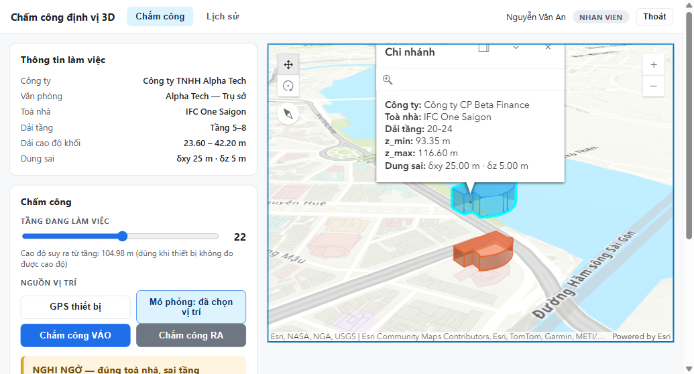
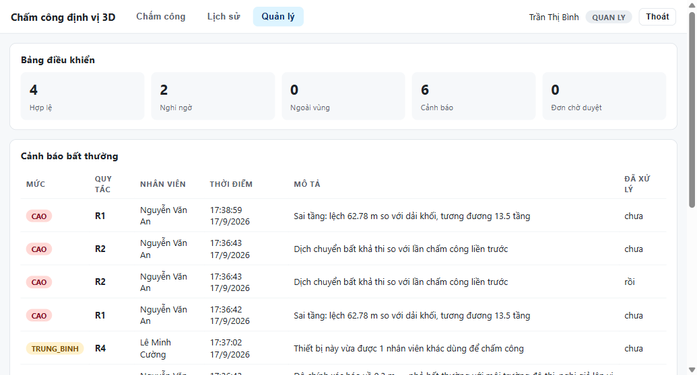

# Hệ thống chấm công định vị 3D

Đồ án môn **IE402 — Hệ thống thông tin địa lý 3 chiều**, nhóm 1.
GVHD: ThS. Phan Thanh Vũ.

Bài toán: hàng rào địa lý hai chiều không phân biệt được người lao động đang ở tầng
nào trong một cao ốc — nhân viên tầng 5 và tầng 22 có **cùng toạ độ kinh/vĩ độ**.
Hệ thống thay phép kiểm tra *"điểm thuộc đa giác"* bằng *"điểm thuộc khối"*, sinh ra
trạng thái mà hệ 2D không tạo được: **đúng toà nhà, sai tầng**.

---

## 1. Chạy hệ thống

### 1.1 Cơ sở dữ liệu

Dựng PostgreSQL + PostGIS theo [`db/README.md`](db/README.md) (có sẵn hướng dẫn bản
portable, không cần Docker và không cần quyền admin), rồi nạp dữ liệu:

```powershell
$bin = "D:\pgportable\pgsql\bin"
& "$bin\createdb.exe" -h 127.0.0.1 -p 55432 -U postgres chamcong3d
& "$bin\psql.exe" -h 127.0.0.1 -p 55432 -U postgres -d chamcong3d -c "CREATE EXTENSION postgis;"
& "$bin\psql.exe" -h 127.0.0.1 -p 55432 -U postgres -d chamcong3d -f db\schema.sql
& "$bin\psql.exe" -h 127.0.0.1 -p 55432 -U postgres -d chamcong3d -f db\seed.sql
```

### 1.2 Máy chủ

```bash
cd server
npm install
cp .env.example .env      # sửa lại nếu cổng/mật khẩu khác
npm start
```

Mở **http://127.0.0.1:3000** — máy chủ phục vụ luôn cả giao diện web trong `web/`.

### 1.3 Tài khoản thử nghiệm

Mật khẩu của cả bốn tài khoản đều là `123456`.

| Tài khoản | Họ tên | Vai trò | Văn phòng |
|---|---|---|---|
| `an.nv` | Nguyễn Văn An | Nhân viên | Alpha Tech — tầng 5–8 |
| `binh.tt` | Trần Thị Bình | Quản lý | Alpha Tech |
| `cuong.lm` | Lê Minh Cường | Nhân viên | Beta Finance — tầng 20–24 |
| `dung.pt` | Phạm Thu Dung | Quản trị | Gamma Media — tầng 35–40 |

> Geolocation API chỉ chạy trên **HTTPS hoặc localhost**. Mở bằng địa chỉ IP nội bộ
> sẽ bị trình duyệt từ chối cấp quyền định vị — khi đó dùng nút **Mô phỏng** để bấm
> chọn vị trí trên bản đồ.

---

## 2. Kịch bản trình diễn

1. Đăng nhập `an.nv` (Alpha Tech, tầng 5–8).
2. Chọn **Mô phỏng**, bấm vào giữa toà nhà trên bản đồ 3D, để tầng ở **6** → chấm công
   VÀO → kết quả **HỢP LỆ**.
3. Kéo tầng lên **22** rồi chấm công lại → **NGHI NGỜ**, kèm cảnh báo **R1** báo lệch
   62,78 m ≈ 13,5 tầng. *Đây là tình huống hàng rào 2D kết luận hợp lệ.*
4. Bấm ra ngoài toà nhà rồi chấm công → **NGOÀI VÙNG**; sang tab **Lịch sử** bấm
   *Gửi giải trình*.
5. Đăng nhập `binh.tt` → tab **Quản lý**: xem bảng điều khiển, danh sách cảnh báo
   R1–R4, duyệt đơn giải trình (bản ghi tự chuyển sang HỢP LỆ và cảnh báo được đóng),
   xem báo cáo công.




---

## 3. Cấu trúc mã nguồn

```
ie402-chamcong-3d/
├── server/                 Máy chủ Node.js + Express
│   └── src/
│       ├── index.js        Khởi tạo app, đăng nhập, phục vụ web tĩnh
│       ├── db.js           Kết nối PostgreSQL
│       ├── auth.js         JWT + phân quyền theo vai trò
│       └── routes/
│           ├── chamcong.js Chấm công, lịch sử, gửi giải trình
│           └── quanly.js   Cảnh báo, duyệt đơn, dashboard, báo cáo
├── web/                    Giao diện (không dùng framework)
│   ├── index.html
│   ├── app.js              Gọi API + dựng bản đồ 3D bằng ArcGIS SDK
│   └── style.css
├── db/
│   ├── schema.sql          15 bảng, 4 hàm, 1 trigger
│   ├── seed.sql            Toà nhà IFC One Saigon + 3 văn phòng + 4 nhân viên
│   └── README.md           Cách dựng PostGIS và kết quả đã kiểm chứng
├── prototype/              Bản dựng đầu tiên: chỉ thuật toán, chạy hoàn toàn ở trình duyệt
├── tools/                  Script sinh tài liệu và sơ đồ
└── docs/                   Sơ đồ đã kết xuất và ảnh chụp màn hình
```

## 4. API

| Phương thức | Đường dẫn | Quyền | Chức năng |
|---|---|---|---|
| POST | `/api/dang-nhap` | — | Đăng nhập, trả JWT |
| GET | `/api/toi` | đã đăng nhập | Thông tin nhân viên + khối MAP của họ |
| GET | `/api/khu-vuc` | đã đăng nhập | Danh sách khối MAP để vẽ bản đồ 3D |
| POST | `/api/cham-cong` | đã đăng nhập | Chấm công: kiểm tra bao hàm khối + áp R1–R4 |
| GET | `/api/cham-cong/lich-su` | đã đăng nhập | Lịch sử của chính mình |
| POST | `/api/giai-trinh` | đã đăng nhập | Gửi đơn giải trình |
| GET | `/api/giai-trinh` | quản lý | Danh sách đơn |
| PUT | `/api/giai-trinh/:id` | quản lý | Duyệt / từ chối |
| GET | `/api/canh-bao` | quản lý | Cảnh báo bất thường |
| GET | `/api/dashboard` | quản lý | Số liệu tổng hợp |
| GET | `/api/bao-cao/cong` | quản lý | Báo cáo công theo tháng |

## 5. Bốn quy tắc phát hiện bất thường

| Mã | Quy tắc | Cài đặt |
|---|---|---|
| R1 | Sai tầng | Trạng thái `NGHI_NGO` kèm độ lệch cao độ, quy ra số tầng |
| R2 | Dịch chuyển bất khả thi | Hàm `kiem_tra_r2()` trong PostGIS, ngưỡng 150 km/h |
| R3 | Độ chính xác bất thường | `accuracy` < 1 m (nghi giả lập GPS) hoặc > 100 m |
| R4 | Trùng thiết bị | Cùng định danh thiết bị, khác nhân viên, trong 10 phút |

## 6. Ghi chú về bảo mật

Đây là môi trường học tập: CSDL dùng `-A trust` và chỉ nghe `127.0.0.1`, khoá JWT để
ở giá trị mặc định trong `.env.example`. Khi triển khai thật phải đổi sang
`scram-sha-256`, sinh `JWT_SECRET` ngẫu nhiên và chạy sau HTTPS.
